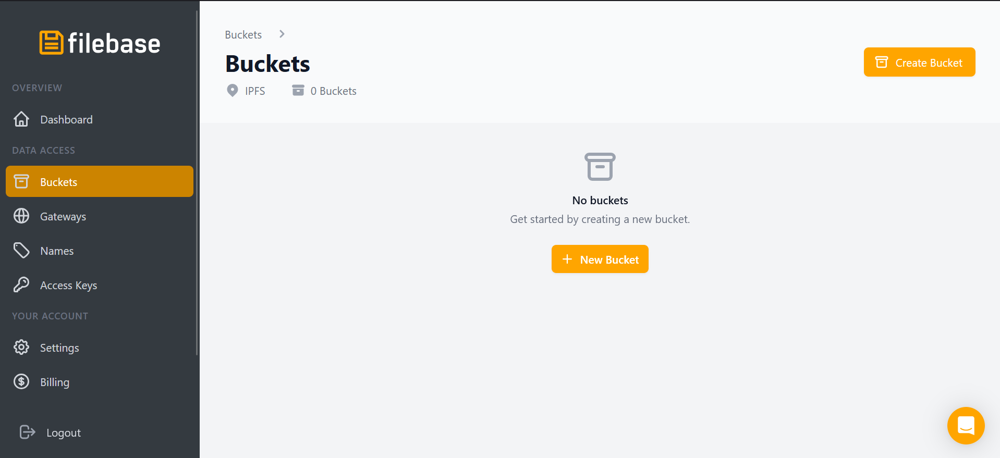
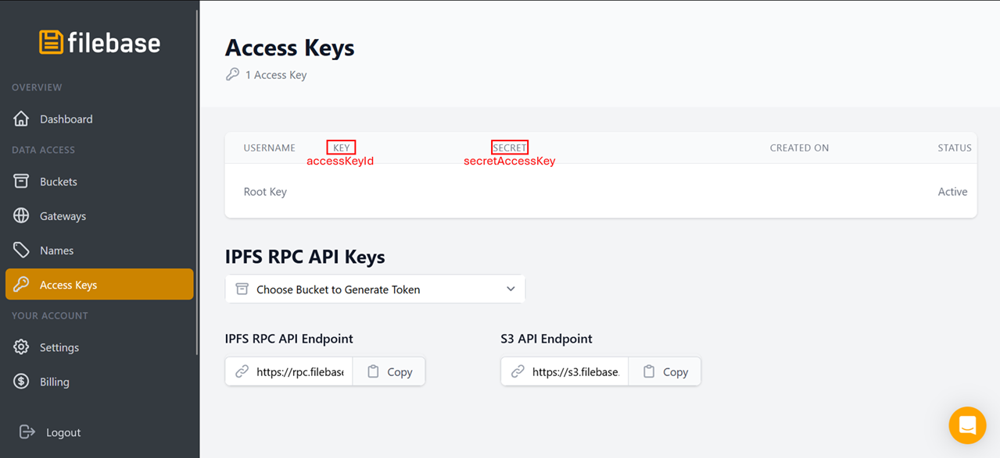

# EduWallet

## Table of Contents

- [EduWallet](#eduwallet)
  - [Table of Contents](#table-of-contents)
  - [🧭Overview](#overview)
  - [📁Project Structure](#project-structure)
    - [browser-extension](#browser-extension)
    - [cli](#cli)
    - [contracts](#contracts)
    - [sdk](#sdk)
    - [hardhat.config.ts](#hardhatconfigts)
    - [package.json](#packagejson)
  - [📦Installation and Setup Instructions](#installation-and-setup-instructions)

## 🧭Overview

EduWallet is a blockchain-based academic registry system that allows universities to issue and students to manage their academic records using Ethereum smart contracts and account abstraction technologies.

## 📁Project Structure

```bash
eduwallet/
├── browser-extension/
├── cli/
├── contracts/
├── sdk/
├── ...
├── hardhat.config.ts
└── package.json
```

Each project folder contains a README that describes the corresponding component.

### [browser-extension](./browser-extension/)

Contains a React-based web application that serves as the student interface for the EduWallet system. It's structured as a modern Chrome extension application that provides students access to their academic records wallet.

### [cli](./cli/)

Contains a command-line interface tool to test the `sdk`. It provides functionality for managing academic credentials, universities, and student records.

### [contracts](./contracts/)

Contains a set of Solidity smart contracts that form the blockchain foundation of the EduWallet system.

### [sdk](./sdk/)

Contains a TypeScript library that provides a streamlined API for interacting with the EduWallet system. It abstracts away the complexities of blockchain interactions and implements account abstraction for improved user experience.

### [hardhat.config.ts](./hardhat.config.ts)

Configures the [Hardhat](https://hardhat.org/) development environment for the project. Hardhat is a development environment for Ethereum smart contract development, designed to help compile, deploy, test, and debug. Key aspects include:

- **Solidity Compiler Settings**:

  - Uses Solidity version `0.8.28`, the latest version fully supported by hardhat
  - Enables optimization with `1,000` runs to reduce bytecode size and keep contracts below the 24,576-byte limit.
  - Targets the `cancun` EVM version for latest Ethereum features

- **Network Configurations**:

  - hardhat: In-memory development network with one preset test account, used to deploy smart contracts and as system administrator
  - localhost: Connection to a local Ethereum node (<http://127.0.0.1:8545>)

### [package.json](./package.json)

**Key Scripts**:

- `build`: Compiles smart contracts and builds all components.
- `dependencies`: Installs dependencies across all project components.
- `build-sdk`: Builds the SDK component.
- `build-cli`: Builds the CLI component.
- `cli`: Runs the CLI via Hardhat on a local network.

## 📦Installation and Setup Instructions

✅**Prerequisites:**

- [Node.js](https://nodejs.org) installed on your system
- [Chrome](https://www.google.it/intl/it/chrome) browser installed on your system.
- Posses a [Filebase](https://filebase.com) account to use the pinning system. After creating the account, you must generate a new bucket in the window shown in the figure below, with a name that is unique (do not use `eduwallet`, since it is already taken).



🛠**Installation steps:**

1. Clone the repository.
2. Install dependencies in all component directories with the command `npm run dependencies` in the project root folder.
3. Change in the [SDK configuration file](./sdk/src/conf.ts) the `ipfsConfig` variable values `bucketName`, `accessKeyId`, and `secretAccessKey` with the ones from your Filebase account (see image below).

4. Compile the smart contracts and build each component with the command `npm run build` in the project root folder.

🛠**Browser extension installation:**

1. After building the extension, follow [the official guide](https://developer.chrome.com/docs/extensions/get-started/tutorial/hello-world?hl=en#load-unpacked) to **load an unpacked extension** in Chrome. The extension directory corresponds to the `dist` folder within the `browser-extension` directory, which is generated during the build process.

🚀**Run the system:**

1. Run `npx hardhat node` in the root folder to run a local Ethereum blockchain.
2. Run `npm run cli` in a second command line window in the root folder to run the CLI and deploy the initial contracts.
3. Use the CLI to register universities and students.
4. Manage students' academic wallets via the extension.
